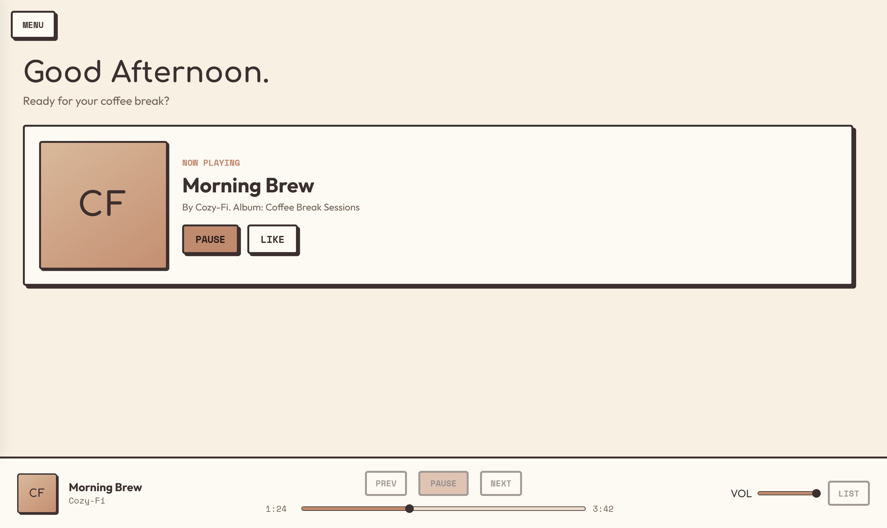
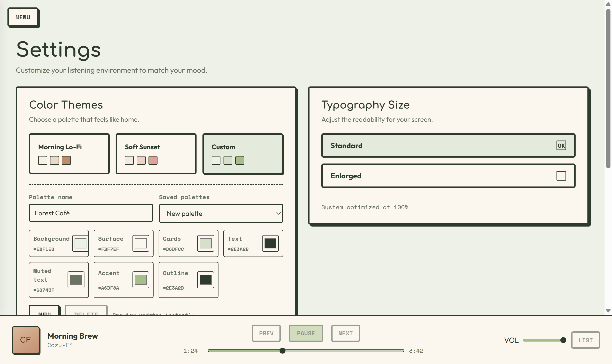
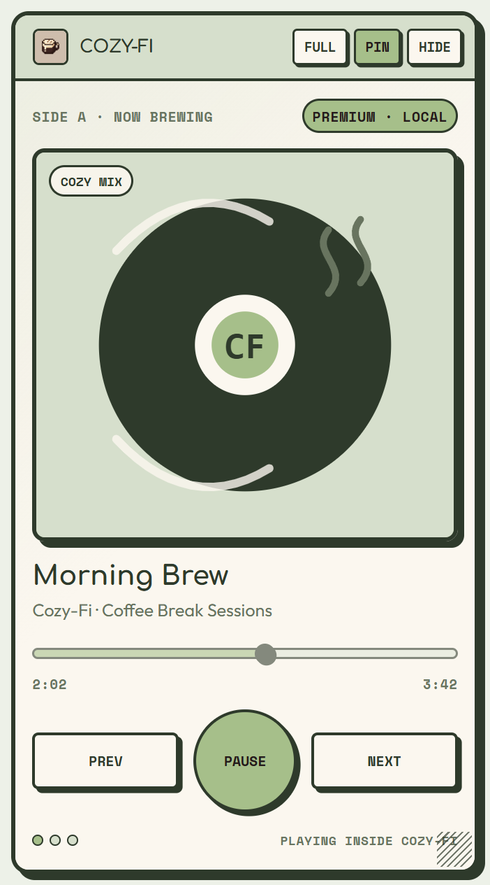

# Cozy-Fi

Cozy-Fi is a cross-platform, retro-cozy desktop companion player for Spotify Premium. The same Electron interface and feature set run on Windows, macOS, and Linux, including Spotify search, saved music, playlists, artists, queue controls, liking, playlist creation, a native local Spotify Connect output, compact layouts, the dockable side player, loading skeletons, pagination, and custom palettes.

This project is intended for personal use and source-code learning. It is not affiliated with, endorsed by, or a replacement for Spotify. Spotify's Developer Policy requires integrations to add independent value and prohibits unapproved apps from replicating or replacing Spotify's core experience.

## Preview



<p align="center">
  
  
</p>

The preview track, artwork, and palette names are fictional and were captured from a disconnected demo profile. No personal Spotify account or library data appears in these images.

## What Cozy-Fi is for

Cozy-Fi gives a Premium listener a focused, customizable desktop interface for their own Spotify account. It is useful when you want a small always-on-top player, a calmer library/search experience, or standalone playback without keeping the Spotify desktop application open.

- Search Spotify and browse saved playlists, albums, artists, liked songs, top tracks, and recent listening.
- Play through Cozy-Fi's local Spotify Connect output on Premium accounts, or use Spotify-link mode as a fallback.
- Control play/pause, previous/next, seeking, volume, queue, likes, and playlist creation.
- Switch between the full responsive app and a resizable, pinnable side player.
- Use Morning Lo-Fi or Soft Sunset, enlarge the typography, or create and save custom seven-color palettes.
- Keep long libraries and result sets manageable with loading skeletons and pagination.
- Run the same source on Windows, macOS, and Linux with native build workflows for each platform.

## Quick start from source

1. Clone or download this repository.
2. Install the requirements listed below.
3. From the repository directory, run:

   ```bash
   npm ci
   npm run icon
   npm run build:librespot
   npm start
   ```

4. Complete the Spotify setup below, then connect from **MENU → Settings**.

`npm run build:librespot` compiles the pinned native playback engine for the current operating system and CPU. Generated playback binaries, local profiles, credentials, and packaged builds are intentionally excluded from the repository.

## Requirements

- Windows x64, macOS Intel/Apple Silicon, or 64-bit Linux
- Node.js 22.12 or later, Git, and a stable Rust toolchain when building from source
- Linux source builds: a C compiler, `pkg-config`, OpenSSL development headers, and ALSA development headers (for Debian/Ubuntu: `build-essential pkg-config libssl-dev libasound2-dev`)
- Spotify Premium
- A Spotify Developer app owned by a Premium account
- Your Spotify account added to that app's allowlist while the app is in Development Mode

Spotify Development Mode currently permits up to five authorized users per app. You can publish this repository's source under its MIT license, but each user/fork should configure its own Spotify Developer app and comply with Spotify's platform rules. One unrestricted public sign-in build requires the appropriate Spotify approval/quota mode.

## Spotify setup

1. Open the [Spotify Developer Dashboard](https://developer.spotify.com/dashboard) and create an app with the Web API selected.
2. Add this exact Redirect URI in the app settings:

   ```text
   http://127.0.0.1:8888/callback
   ```

3. Add the Spotify account(s) that will test the app under the app's user-management/allowlist settings.
4. Copy the app's Client ID. Cozy-Fi uses Authorization Code with PKCE, so a Client Secret is neither requested nor stored.
5. Start Cozy-Fi, open Settings, paste the Client ID, select **CONNECT**, and approve the requested Spotify permissions.
6. On the first connection only, approve the separate **local-player** authorization in the Cozy-Fi window. Use the same Premium account for both authorizations.

After that one-time setup, Cozy-Fi starts its saved local player automatically. The Spotify desktop app and a web browser can remain closed while searching, playing, pausing, seeking, changing volume, and managing the queue in Cozy-Fi.

Settings includes three playback choices:

- **Auto** attempts to register the Cozy-Fi local player. A successful registration verifies standalone/Premium capability.
- **Cozy-Fi standalone** explicitly requests the same Premium-only local-player behavior.
- **Spotify app / browser** does not start the local player. Selecting a track or context opens it in Spotify, and transport/queue controls remain there.

## Side player

Open **MENU → Side Player** to switch into the compact player; the full window hides so only the side player remains. Its live Spotify artwork, timeline, play/pause, previous, and next controls use the same playback session as the full app. Drag the lower-right grip to resize it, or focus the grip and use the arrow keys. **PIN** toggles always-on-top, **FULL** (or a title-bar double-click) hides the compact window and restores the full app, and **HIDE** minimizes the side player so it can be restored from the taskbar or dock. Its size and screen position are remembered.

Morning Lo-Fi, Soft Sunset, enlarged type, and custom palette previews are mirrored into the side player immediately. Standalone mode provides all compact controls; Spotify App mode shows the selected track with an **OPEN** action because transport controls remain in Spotify.

Spotify removed the `product` subscription field from `GET /me` for Development Mode apps in February 2026, so Cozy-Fi cannot always read a trustworthy Free/Premium label directly. It uses capability detection instead and never treats an ordinary network error as proof that an account is Free. Spotify's current [Web API requirements](https://developer.spotify.com/documentation/web-api) also require Premium, so external mode is a graceful link fallback—not a way to give Free accounts the full Cozy-Fi library/search experience.

The Web API refresh token stays in Electron's user-data directory only when operating-system credential encryption is available; otherwise it remains memory-only for that run. Access tokens are kept in the main process and are never exposed to page JavaScript, local storage, or child-process command arguments.

## Customization

Open **MENU → Settings** to choose a preset theme or select **Custom**. A custom palette controls the background, surface, card, primary text, muted text, accent, and outline colors. Name the palette and select **SAVE PALETTE** to keep it locally. Saved palettes and font-size preferences stay on that computer and update the full app and side player together.

Custom themes include automatic derived hover, shadow, progress, and contrast colors. Very low-contrast text/accent combinations are rejected so controls remain readable.

## Development

```bash
npm ci
npm run icon
npm run build:librespot
npm test
npm start
```

`npm run build:librespot` builds the pinned, patched playback engine for the current operating system and CPU architecture, records its SHA-256 in `librespot-checksums.json`, and marks it executable on macOS/Linux. Native playback binaries cannot be safely cross-compiled by the packaging command: each package must be created on a matching host.

`npm test` runs JavaScript syntax checks and a disconnected Electron UI smoke test at the app's minimum supported size. It checks every page and the navigation drawer for reachable content, plus side-player artwork, resizing, single-window transitions, loading states, themes, pagination, and playback controls. On a headless Linux build machine, run it through Xvfb: `xvfb-run -a npm test`. A real Spotify integration test still requires a dedicated allowlisted Premium test account and cannot run in CI without credentials.

To create and verify an unpacked build for the current host and architecture:

```bash
npm run release:check
```

The native outputs are:

| Host | Output |
| --- | --- |
| Windows x64 | `dist/Cozy-Fi-win32-x64/Cozy-Fi.exe` |
| macOS Intel | `dist/Cozy-Fi-darwin-x64/Cozy-Fi.app` |
| macOS Apple Silicon | `dist/Cozy-Fi-darwin-arm64/Cozy-Fi.app` |
| Linux x64 | `dist/Cozy-Fi-linux-x64/Cozy-Fi` |

The scripts `dist:windows`, `dist:mac:intel`, `dist:mac:arm`, and `dist:linux` select an explicit target, but they still require a matching native host and playback binary. The GitHub Actions workflow in `.github/workflows/cross-platform.yml` builds and verifies all four release variants on native runners and uploads a ZIP or compressed TAR artifact.

The playback build uses the pinned librespot 0.8.0 commit and applies `patches/librespot-cozy-fi.patch`. That patch limits authorization to the `streaming` scope and keeps the authorization window inside Cozy-Fi. Every packaged app verifies its platform-specific binary against the checksum stored inside the ASAR.

The packaging command explicitly excludes local browser profiles, development notes, previous builds, and caches. The bundled playback executable must remain unpacked beside the Electron application resources. Run `npm run release:check` before sharing a binary; it rebuilds and verifies the ASAR contents, bundled playback checksum/version, and packaged UI smoke test.

The generated folders are unsigned, unpacked personal builds rather than installers. Windows SmartScreen and macOS Gatekeeper may warn about them; public release artifacts should be signed, and macOS releases should also be notarized. Linux users should keep the executable bit preserved by the `.tar.gz` artifact.

## Current Spotify constraints

- Playback and the Spotify Web API require Premium under Spotify's current platform rules.
- Spotify's [February 2026 Development Mode migration](https://developer.spotify.com/documentation/web-api/tutorials/february-2026-migration-guide) removed the profile `product` field. Auto mode therefore detects successful standalone registration rather than guessing the subscription from missing profile data.
- Development Mode apps are limited to authorized users and are not a general consumer sign-in channel.
- Spotify's February 2026 Development Mode API no longer exposes the item list of followed playlists unless the current user owns or collaborates on them. Those playlists may appear in the library, but Cozy-Fi cannot display their rows through the API.
- The former Recommendations endpoint is not used. The Recommended area combines the user's top and recently played tracks instead.
- Spotify stopped accepting third-party developer access tokens for its private playback endpoints in August 2026. Cozy-Fi therefore performs a separate interactive local-player authorization and retains the resulting player credential for later starts.
- The local output is powered by the open-source `librespot` project, not Spotify's official Web Playback SDK. Cozy-Fi builds its default Rodio output natively for each operating system. This is a personal, unofficial playback path that Spotify can change or block. Review Spotify's terms before using or redistributing it. Spotify's official Soloist player is Linux-only as of August 23, 2026.
- Cozy-Fi can display and resume the current podcast episode, but Spotify's track-URI playback endpoint does not support selecting a queued episode; those queue entries open in Spotify.
- Library views load up to 500 items per category to avoid excessive API traffic and render them in bounded client-side pages.

## Security and privacy

- Electron runs with renderer sandboxing, context isolation, no Node integration, and a narrow preload API.
- Spotify OAuth uses PKCE plus a random state value and an exact loopback callback.
- User-controlled Spotify metadata is escaped or written with `textContent` before display.
- Disconnecting deletes the locally retained Spotify refresh token and local-player credential, then stops the playback process.
- The local-player credential is written by librespot under Electron's per-user application-data directory. It is not passed on the command line and is removed by **DISCONNECT**, but librespot does not encrypt that cache file itself. Protect your operating-system account and do not share the app-data folder.
- On Linux, Cozy-Fi refuses to persist the Web API refresh token when Electron only offers the insecure `basic_text` backend. Install and unlock a supported Secret Service/KWallet keyring for persistent sign-in; otherwise the token stays memory-only for that run.
- See [PRIVACY.md](PRIVACY.md) before sharing a build with another tester.

## License

Cozy-Fi source code is available under the [MIT License](LICENSE). Native `librespot` binaries, Spotify content, Spotify marks, album artwork, and metadata are governed by their own licenses and terms and are not relicensed by this repository. See [THIRD_PARTY_NOTICES.md](THIRD_PARTY_NOTICES.md) for the bundled playback engine's version, license, source revision, and checksum manifest.
